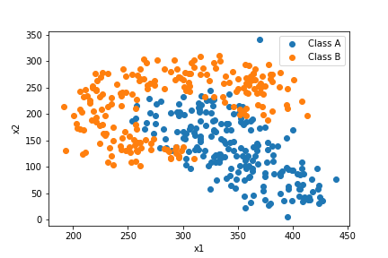
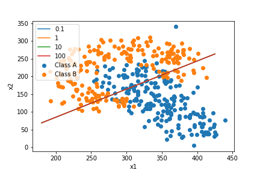
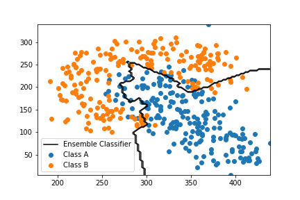

# Linear_SVM_AdaBoost

In this repository an adaboost classifier based on linear SVM was designed to classify the dataset combining 'classA.csv' and 'classB.csv'. Class A and Class B datasets are visualized below in Figure 1. 

*Figure 1. Datasets 'classA.csv' and 'classB.csv'.*  

A linear SVM with varying C values {0.1, 1 , 10 , 100} was trained and the decision boundary was visualized alongside the reported accruuacy based on 10-times-10-fold cross validation.The linear SVM decision boundary is shown in Figure 2 for varying C values. 

*Figure 2.Decision boundary of varying C values.*  

The accuracy results of the linear SVM classifiers obtained using 10-times-10-fold cross validation are reported in Table I. 
TABLE I: LINEAR SVM ACCURACY RESULTS
| C Value         | 0.1    | 1      | 10     | 100    |
|-----------------|--------|--------|--------|--------|
| Accuracy - Mean | 79.35% | 79.80% | 79.77% | 79.75% |

An ensemble of classifiers was created based on the Adaboost-M1 approach to classify
the dataset. A linear SVM was used with the C=1 as the weak
learner classifier. The maximum number of weak learners was taken as T = 50. 

The ensemble model decision boundary using Linear SVM is shown in Figure 3.
*Figure 3. Decision boundary of ensemble model.*   
The mean and variance of the accuracy results for the 10-times-10 fold cross validation of the ensemble learning using linear SVM are reported in Table II. 
TABLE II: LINEAR SVM ENSEMBLE LEARNING RESULTS
| Accuracy | Variance | Standard Deviation |
|:--------:|:--------:|:------------------:|
|  89.29%  |  23.98%  |        4.90%       |

